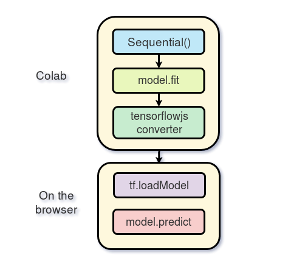

# Machine Learning by Examples

Machine Learning by Examples using Scikit-Learn, Keras, TensorFlow, PyTorch, and OpenCV.

> 1. [Google Colab Notebooks](colab.research.google.com) (Free Nvidia Tesla K80 GPU)
> 2. Sketcher using Keras/TensorFlow and QuickDraw-Dataset
> 3. Disease-Prediction using Machine Learning (Scikit-Learn)
> 4. Recruitment Matching using Machine Learning (Keras & Tesorflow)

## 1.1. Configuring Development Environment using [Google Colab Notebooks](colab.research.google.com)

- [x] Step 1. [Creating Folder on Google Drive](drive.google.com) or choose the default `Colab Notebooks` folder
- [x] Step 2. Opening or Creating a `Colab Notebook
  - [x] Openning 
  - [x] Google Drive: upload [](https://github.com/vbosstech/disease-diagnostic-from-symptoms/archive/master.zip) onto `My Drive/machine-learning`
  - `Google Drive`: `My Drive/machine-learning/disease-diagnostic-from-symptoms/disease_symptoms_data_analysis_DecisionTree.ipynb` > *Open with* > *Colaboratory* 
  - [x] Creating new *Colab Notebook* via *Right click > More > Colaboratory*
- [x] Step 3. Setting Free GPU: 
  - [x] [Google Colab](colab.research.google.com): Edit > Notebook settings: 
    - [x] Runtime type: `Python 3` 
    - [x] Hardware accelerator: `GPU`
- [x] Running or Importing Files with Google Colab
     ```
         from google.colab import drive
         drive.mount("/content/gdrive", force_remount=True)
     ```
     Note: Click the link, copy verification code and paste it to text box; then we can use `/content/gdrive/My Drive/`
- [x] Install Python Module/Package
     ```
         # Install Excel/GoogleSheet Python module
         !pip3 install --upgrade -q gspread
         !pip3 install --upgrade -q xlrd
         
         # Install Keras
         !pip3 install -q keras
         !pip3 install torch torchvision
     ```
- [x] Google Colab Notebooks
     ```
         # RAM & CPU
         !cat /proc/meminfo
         !cat /proc/cpuinfo
         # Restart Google Colab
         !kill -9 -1
     ```
- Note: 12-hour GPU limit is for a continuous assignment of VM.

## 1.2. Usefull Utilities

### 1.2.1. [Facets](https://github.com/PAIR-code/facets) 

### 1.2.2. [Tensorboard](https://github.com/mixuala/colab_utils)



## 2. Sketcher using Keras/TensorFlow and QuickDraw-Dataset

A simple tool that recognizes drawings and outputs the names of the current drawing. We will use Google Colab for training the model, and we will deploy & run directly on the browser using TensorFlow.js.

### 2.1. Dataset
We will use a CNN to recognize drawings of different types. The CNN will be trained on the [Quick-Draw Dataset](https://github.com/googlecreativelab/quickdraw-dataset).


### 2.2. 

## 2. Disease-Prediction using Machine Learning (Scikit-Learn)


## 3. Recruitment Matching using Machine Learning (Keras & Tesorflow)

### 

## References

- 
- [FastAI](https://github.com/fastai/fastai)